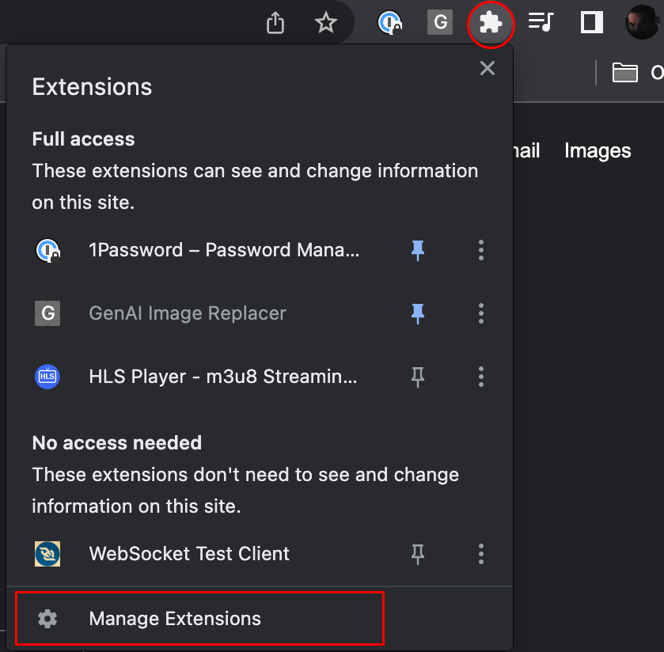
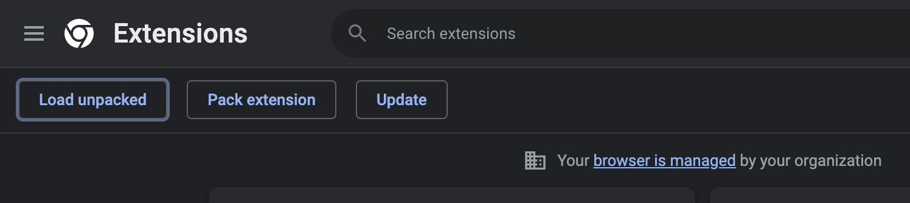
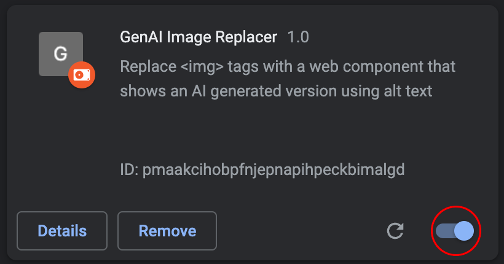
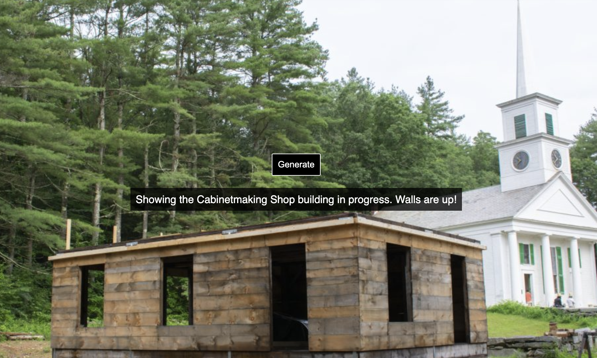

# GenAI Image-Replace
Chrome extension to replace images on a page with AI generated ones using the alt/accessibility text

### Quick Info
If you already get the gist and know how to install a Chrome extension locally (without the store) and can navigate github,
here's some quick pointers:
- When activated, the Chrome extension will always be available to run, but never
requests images from the image generation service until activated for the page
- To activate this extension on a specific page, hit the key combo CONTROL+S
- Once activated, you'll see an alert. Now when hovering over images, you'll see a "Generate" button. Click to generate an image from accessibility text
- This will only work on `` tags. Other image representations will be untouched. Therefore simple pages that look and act like a blog post will give the best results

### A few example websites I've found this works well on
https://www.simplyrecipes.com/orange-breakfast-rolls-recipe-6744941

https://www.osv.org/explore-the-village/cabinetmaking/

https://www.bbc.com/

### What is this, really?
HTML is the markup language used to make web pages. One of the many tags used is ``. With `` your can
specify a `src` attribute. For example ``, and voila you've put an image on a web page!

One important aspect of using images is to add accessibility text to help visually impaired folks understand the 
content of the image if they have difficulty seeing it. They may use screen readers to take this accessibility text and
have it read to them as they browse the page.

For example: ``

If you're familiar with AI image generation, this might
look like a "prompt" to you! Basically you can enter text, such as my alt text example above, to describe something with 
words, and (fingers crossed) you'll get back an image from those words.

With all that said, this is a Chrome extension that allows you to go to a page
and when you hit CONTROL+S, all `` tags found will be replaced with a 
custom web component. Hover over any image to see it's accessibility text, and press "Generate" to use that text as prompt to generate an image

### How to use it
Install the plugin and activate it.
To do this, download the code from [https://github.com/Web-Components-in-Space/image-replace](https://github.com/Web-Components-in-Space/image-replace)

Click the "Code" button to expose the popup. Then click on "Download ZIP".

Put this zip file somewhere safe and unzip it. You now have an un-official Chrome extension!

Next lets load this up as an extension. We're not going through the official store
for this one, so it's a bit more DIY than it should be.

Now, in Chrome, click on the extensions icon to load
the `Extensions` popup. Then click "Manage Extensions".

In the extension manager, click `Load Unpacked`.
From here, navigate to folder you've just unzipped.

Once loaded, your extension should appear in the extension manager.
Ensure it's on by making sure the toggle is in the right/on position.

Happy browsing! Go to any webpage, within reason. See below for details on where this 
extension works best.

When you've visited the website you'd like to see an AI image generated view of,
press the key combo CONTROL+S.

After hitting this key combo, you'll see an alert that you're now in generation mode.
Hover over any image on the page to see it's accessibility text as well as the "Generate" button

You'll see the original image animate like a slot machine while waiting for the 
response.

Hover over the image again and click "Show Original" to go back to the original image.

### Why this only works sometimes
First of all, lots of pages don't bother with accessibility text at all. This is bad
on them. If this is the case, we won't hit Adobe services to generate an image based on
nothing. Instead, you'll see a red radial gradient with the text `No Alt text provided`.

You may also notice that some (or all) images go untouched by this plugin.
This is probably due to the page not using image tags at all, but
placing image backgrounds on `
` tags with styling.

This may mean that the page is being negligent on using accessibility text.
But it might not mean that. I'm not up to date on all the ways screen readers
can work, but it's possible that there is an offscreen `` tag that takes care 
of this. Or (and I'm not sure how effective this is) there may be a `title` attribute
to represent this accessibility text.

Lastly, we are messing with the page! Sometimes the image
might disappear entirely because Javascript is managing the images 
in some way.

With all of this in mind - you'll have the best luck on simple pages.
Interactive carousels probably won't work. But sites that are essentially
blogs stand the best chance of working. Basically lots of words to tell a story
or sell a product mixed with images to better communicate a point.

